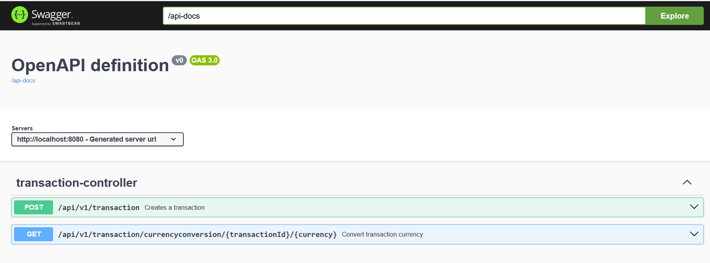
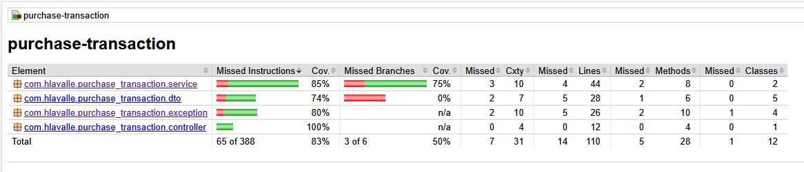

# purchase-transaction

The purchase-transaction application has two operations (endpoints):

1. Accepts and stores a purchase transaction with a description, transaction date and purchase amount in United State dollars. When the transaction is stored it's assigned an unique identifier.
2. Retrieves a purchase transaction in a specified country's currency.

The OpenAPI documentation can be viewed on http://localhost:8080/swagger-ui/index.html when running the application locally.



> This version of the application persists purchase transactions in an H2 in-memory database, so they belong only to each execution context and are lost as soon as the application is closed.

## Prerequisites

* Maven
* Java 17

## Build

```
$ mvn package
```

## Test

```
$ mvn test
```

### Test coverage

After running the tests a JaCoCo report can be viewed opening the file target/site/jacoco/index.html on a web browser.



## Run

```
$ mvn spring-boot:run
```

## Recommendations for future improvements

* Change the database to one that allows data persistence between application runs. Currently, the in-memory H2 database is used.
* Protect access to endpoints with Oauth2 or API key (spring security).
* Evaluate OWASP API Security TOP 10 recommendations: https://owasp.org/API-Security/editions/2023/en/0x00-header/
* Create configuration for execution profiles in the environments where necessary, for example: dev, quality, stage, and production.
